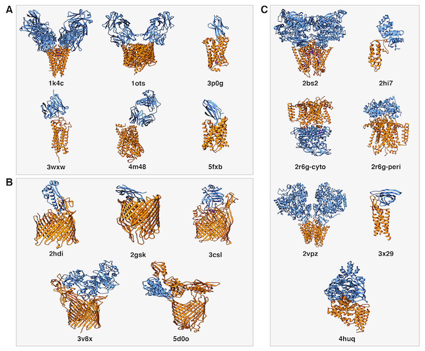

# Integrative Modeling of Membrane-associated Protein Assemblies: Dataset

## 1. Introduction

This is the repository containing the dataset for the *Integrative Modeling of Membrane-associated Protein Assemblies* manuscript.




## 2. Data organization

In top folder:

* `pdbs.list`: list of all the PDB codes of the benchmark.
* `antibodies.list`: list of all the PDB codes of the benchmark which are antibody complexes (category **A** in figure).
* `barrel.list`: list of all the PDB codes of the benchmark which structure is beta-barrel (category **B** in figure).
* `helical.list`: list of all the PDB codes of the benchmark which structure is helical (category **C** in figure).

### 2.1. Docking

Docking protocols can be found in the `docking` folder. For each of the two protocols (LightDock and ZDock), data for the different scenarios is provided:

#### 2.1.1. LightDock

Folder `docking/lightdock` containts data for the different six scenarios: `average`, `blind`, `filtered`, `membrane`, `minimum` and `restraints`.

Each of the scenarios contains for the 18 complexes of the benchmark the following data:

* `lgd_clustered_rank.list`: Ranking of the top clustered structures generated by LightDock. For each line, name of the PDB complex file and values for fnat, i-RMSD, l-RMSD and LightDock score are provided.
* `top100.tgz`: Top 100 predicted models generated by LightDock.
* `setup.json`: LightDock generated setup file which contains information about all the parameters used for the setup of the simulation.
* `receptor_membrane.pdb` or `receptor.pdb`: Starting receptor PDB structure. If file contains membrane beads, name contains the word *membrane*.
* `ligand.pdb`: Starting ligand PDB structure
* `lightdock_*` files: LightDock parsed and processed PDB structures.
* `restraints.list`: residue restraints in the LightDock-ready format.

#### 2.1.2. ZDock

Folder `docking/zdock` containts data for the different four scenarios: `average`, `blind`, `maximum` and `minimum`.

Each of the scenarios contains for the 18 complexes of the benchmark the following data:

* `zdock_rank.list`: Ranking of the top structures generated by ZDock. For each line, name of the PDB complex file and values for fnat, i-RMSD and l-RMSD are provided.
* `zdock.out`: Result of the ZDock simulation.
* `top100.tgz`: Top 100 predicted models generated by ZDock.
* `receptor.pdb` and `ligand.pdb`: PDB files for the starting structures (receptor and ligand respectively).
* `*.block`: list of residues blocked for the scenario. In case of antibody-antigen complex, a `cdr.block` file is also provided with the list of blocked residues corresponding to the CDR predicted loops.
* `receptor_rotated.pdb` and `ligand_rotated.pdb`: PDB files for the starting structures after being randomly rotated to avoid simulation artifacts (receptor and ligand respectively).
* `receptor_blocked.pdb` and `ligand_blocked.pdb`: PDB files with blocked residues according to the ZDock protocol (receptor and ligand respectively).
* `receptor_surface.pdb` and `ligand_surface.pdb`: PDB files with marked surface residues according to the ZDock protocol (receptor and ligand respectively).


### 2.2. Refinement

Refinement with HADDOCK-CG protocol can be found at `refinement/haddock`. Results of the refinement protocol for two scenarios are provided: `blind` and `membrane`. Each of these scenarios contains a folder for each of the complexes of the dataset. For each complex, two files are provided:

* `haddock_rank.list`: for each of the diffeerent models refined, values for fnat, i-RMSD, l-RMSD and scoring is provided. For example:

 ```
 1k4c_80w.pdb   0.0   20.182   50.751   -217.43964
 ```

* `models.tgz`: compressed tar archive which contains the top 100 models refined by the HADDOCK-CG protocol.

In addition, an example of `run.param` and `run.cns` for performing HADDOCK refinement is provided in `refinement/example`.
